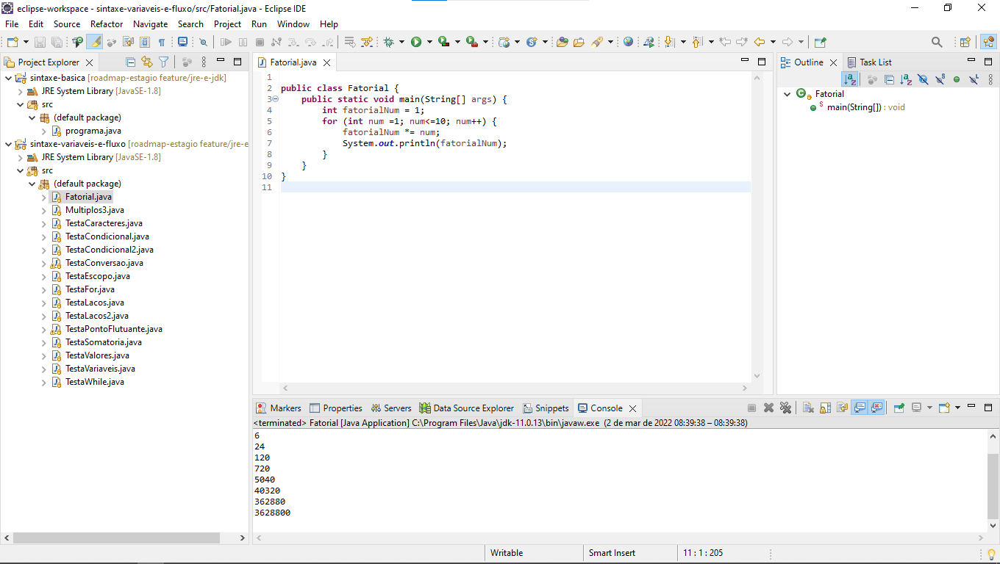
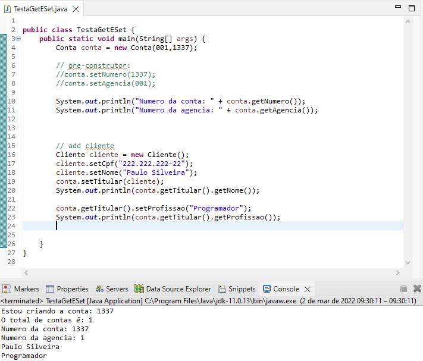
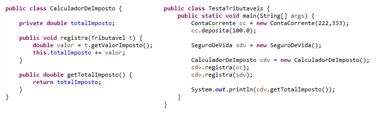
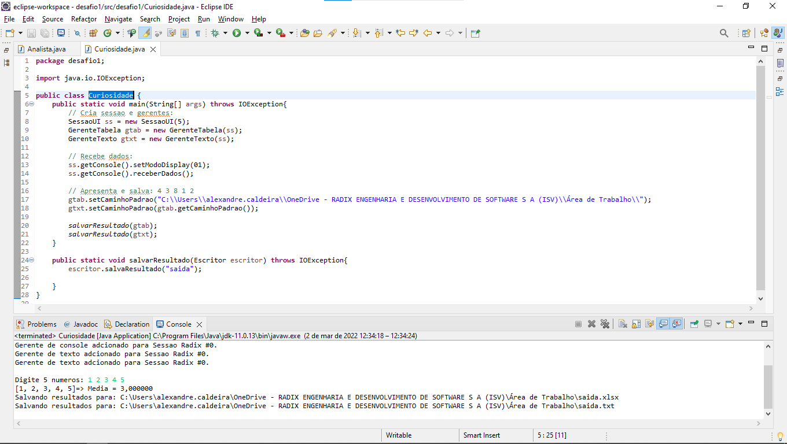

# Roadmap Estágio Radix UNMMA 2022

- Índice
    + [****Git & Github****](#git--github)
    + [****Estratégias de ramificação, Conflitos e Pull Requests****](#estratégias-de-ramificação-conflitos-e-pull-requests)
    + [****Java, JRE e JDK****](#java-jre-e-jdk)
    + [****Java OO: Introdução à Orientação a Objetos****](#java-oo-introdução-à-orientação-a-objetos)
    + [****Java Polimorfismo: Entenda herança e interfaces****](#java-polimorfismo-entenda-herança-e-interfaces)
    + [****DESAFIO 1****](#desafio-1)
    + [****Java Exceções****](#java-exceções)
    + [****Java e java.lang: Object e String****](#java-e-javalang-object-e-string)
    + [****Java: Estrutura de Dados e java.util****](#java-estrutura-de-dados-e-javautil)
    + [****DESAFIO 2****](#desafio-2)
    + [****Maven e TDD****](#maven-e-tdd)
    + [****Bancos de Dados: Modelagem e SQL****](#bancos-de-dados-modelagem-e-sql)
    + [****Java JDBC****](#java-jdbc)
    + [****Java JPA****](#java-jpa)
    + [****DESAFIO 3****](#desafio-3)
    + [****Spring****](#spring)
    + [****BOAS PRÁTICAS****](#boas-práticas)

## Git & Github

> [⬆️ Índice](#roadmap-estágio-radix-unmma-2022)
>
> [https://cursos.alura.com.br/course/git-github-controle-de-versao/task/57005](https://cursos.alura.com.br/course/git-github-controle-de-versao/task/57005)

### Tópicos:

- [01. O que é Git?](Git%20&%20Github/01%20O%20que%20e%CC%81%20Git.md)

- [02. Iniciando os trabalhos](Git%20&%20Github/02%20Iniciando%20os%20trabalhos.md)

- [03. Compartilhando o trabalho](Git%20&%20Github/03%20Compartilhando%20o%20trabalho.md)

- [04. Trabalhando em equipe](Git%20&%20Github/04%20Trabalhando%20em%20equipe.md)

- [05. Manipulando as versões](Git%20&%20Github/05%20Manipulando%20as%20verso%CC%83es.md)

- [06. Gerando entregas](Git%20&%20Github/06%20Gerando%20entregas.md)

## ****Estratégias de ramificação, Conflitos e Pull Requests****

> [⬆️ Índice](#roadmap-estágio-radix-unmma-2022)
>
> [https://cursos.alura.com.br/course/git-github-branching-conflitos-pull-requests](https://cursos.alura.com.br/course/git-github-branching-conflitos-pull-requests)

### Tópicos:

- [01. GitHub e OpenSource](Git%20&%20Github/01%20GitHub%20e%20OpenSource.md)

- [02. Controle avançado de conflitos](Git%20&%20Github/02%20Controle%20avanc%CC%A7ado%20de%20conflitos.md)

- [03. Estratégias de branching](Git%20&%20Github/03%20Estrate%CC%81gias%20de%20branching.md)

- [04. Ferramentas visuais](Git%20&%20Github/04%20Ferramentas%20visuais.md)

- [05. Hooks e deploy com Git](Git%20&%20Github/05%20Hooks%20e%20deploy.md)

## ****Java, JRE e JDK****

> [⬆️ Índice](#roadmap-estágio-radix-unmma-2022)
>
> [https://cursos.alura.com.br/course/java-primeiros-passos](https://cursos.alura.com.br/course/java-primeiros-passos)

### Tópicos:

- [Java e IDE Eclipse, teoria e exemplos](https://github.com/Alexandre-Caldeira/roadmap-estagio/tree/main/java/jre-e-jdk)

    > 

## ****Java OO: Introdução à Orientação a Objetos****

> [⬆️ Índice](#roadmap-estágio-radix-unmma-2022)
>
> [https://cursos.alura.com.br/course/java-introducao-orientacao-objetos](https://cursos.alura.com.br/course/java-introducao-orientacao-objetos)

### Tópicos:

- [Objetos, encapsulamento, composição](https://github.com/Alexandre-Caldeira/roadmap-estagio/tree/main/java/java-oo)

    > 

 
## ****Java Polimorfismo: Entenda herança e interfaces****

> [⬆️ Índice](#roadmap-estágio-radix-unmma-2022)
>
> [https://cursos.alura.com.br/course/java-heranca-interfaces-polimorfismo](https://cursos.alura.com.br/course/java-heranca-interfaces-polimorfismo)

### Tópicos:

- [Classes abstratas, herança, interfaces, super, protected](https://github.com/Alexandre-Caldeira/roadmap-estagio/tree/main/java/java-poli)

    > 

## ****Desafio 1****

> [⬆️ Índice](#roadmap-estágio-radix-unmma-2022)
>
> Desafio prático aplicando conceitos de OO em Java.

### Tópicos:

- [Polimorfismo, encapsulamento, herança, abstração](https://github.com/Alexandre-Caldeira/roadmap-estagio/tree/main/desafio1)

    > 

## ****Java Exceções****

> [⬆️ Índice](#roadmap-estágio-radix-unmma-2022)
>
> [Java Exceções: Aprenda a criar, lançar e controlar exceções](https://cursos.alura.com.br/course/java-excecoes)

### Tópicos:

- [Stack, HEAP, garbage collector, depuração, exceptions, try-catch](java/java-exceptions/README.md)

## ****Java e java.lang: Object e String****

> [⬆️ Índice](#roadmap-estágio-radix-unmma-2022)
>
> [Java e java.lang: Programe com a classe Object e String](https://cursos.alura.com.br/course/java-pacotes-e-java-lang)

### Tópicos:

- [Pacotes, modificadores de visibilidade, Object, String](java/java-lang/Lang.md)

- [TODO]()

## ****Java: Estrutura de Dados e java.util****

> [⬆️ Índice](#roadmap-estágio-radix-unmma-2022)
>
> [Estrutura de Dados: computação na prática com Java](https://www.alura.com.br/curso-online-estrutura-de-dados)
>
> [Java e java.util: Coleções, Wrappers e Lambda expressions](https://cursos.alura.com.br/course/java-util-lambdas) 

### Tópicos:
- [Listas, Pilhas, Vetores, Sets, Collection, Collections, Casting, Wrappers, Lambdas](java/java-util/README.md)

## ****Desafio 2****

> [⬆️ Índice](#roadmap-estágio-radix-unmma-2022)
> 
> [Descricão do Desafio 2](desafios/desafio2/descricao.md)

### Tópicos:
- [UserStory Modelling, MVP, UML, PIMS, HTTP Clients e Requests, REST APIs, Cache, Sobrecarga, Sobrescrita, Lambdas, Cache, ](desafios/desafio2/README.md)

+

## ****Maven e TDD****

> [⬆️ Índice](#roadmap-estágio-radix-unmma-2022)
>
> [Maven: gerenciamento de dependências e build de aplicações Java](https://www.alura.com.br/curso-online-maven-gerenciamento-dependencias-build-aplicacoes-java)
>
> [TDD e Java: testes automatizados com JUnit](https://www.alura.com.br/curso-online-tdd-java-testes-automatizados-junit)
>
> [Mocks em Java: conhecendo o Mockito](https://www.alura.com.br/curso-online-mocks-java-mockito)

### Tópicos:
- [Maven, dependências, pom.xml, plugins e builds](java/java-maven/README.md)
- [JUnit, TDD e exceções](testing/junit/README.md)
- [Mockito e exceções](testing/mockito/README.md)

## ****Bancos de Dados: Modelagem e SQL****

> [⬆️ Índice](#roadmap-estágio-radix-unmma-2022)
>
> [Modelagem de banco de dados relacional: entidades, relacionamentos e atributos](https://www.alura.com.br/curso-online-modelagem-banco-relacional-entidade-relacionamento-atributo)
>
> [Modelagem de banco de dados relacional: diagrama ER e Modelo Relacional](https://www.alura.com.br/curso-online-modelagem-banco-relacional-entidade-relacionamento-modelo-relacional)
>
> [Modelagem de banco de dados relacional: normalização](https://www.alura.com.br/curso-online-modelagem-banco-relacional-normalizacao)
>
> [Introdução ao SQL com MySQL: manipule e consulte dados](https://www.alura.com.br/curso-online-mysql-manipule-dados-com-sql)

### Tópicos:
- Entidades, relacionamentos, atributos, Diagrama ER
- Transformando um Diagrama ER em Esquema Relacional
- Formas Normais, exemplos, SQL, CRUD, Joins, Stored Procedures
- [Resumo](dados/databases/README.md)

## ****Java JDBC****
> [⬆️ Índice](#roadmap-estágio-radix-unmma-2022)
>
> [Java e JDBC: trabalhando com um banco de dados](https://www.alura.com.br/curso-online-jdbc-dao-persistencia)

### Tópicos: 
- [JDBC, Statement, ResultSet, DAO, Connection Pool, Datasources](dados/java-jdbc/README.md)

## ****Java JPA****
> [⬆️ Índice](#roadmap-estágio-radix-unmma-2022)
>
> [Persistência com JPA: introdução ao Hibernate](https://www.alura.com.br/curso-online-persistencia-jpa-introducao-hibernate)
>
> [Persistência com JPA: introdução ao Hibernate](https://www.alura.com.br/curso-online-persistencia-jpa-introducao-hibernate)

### Tópicos: 
- [Persistência de dados usando JDBC, JPA, Hibernate](dados/java-jpa/README.md)

## ****DESAFIO 3****
> [⬆️ Índice](#roadmap-estágio-radix-unmma-2022)
>
> ORM de parte do banco de dados "AdventureWorks" empregando JPA

### Tópicos:
- [JPA, ORM, JPQL, MySQL](https://github.com/Alexandre-Caldeira/roadmap-estagio/tree/main/desafios/desafio3)

 + 

## ****SPRING****
> [⬆️ Índice](#roadmap-estágio-radix-unmma-2022)
>
> [Spring Data JPA: Repositórios, Consultas, Projeções e Specifications](https://www.alura.com.br/curso-online-spring-data-jpa)
>
> [Spring Boot API REST: construa uma API](https://www.alura.com.br/curso-online-spring-boot-api-rest)
>
> [Spring Boot API REST: Segurança da API, Cache e Monitoramento](https://www.alura.com.br/curso-online-spring-boot-seguranca-cache-monitoramento)

### Tópicos:
- [Repositório Spring Data JPA](https://github.com/alura-cursos/1795-curso-spring-data)
- [Workspace Spring Data JPA](https://github.com/Alexandre-Caldeira/roadmap-estagio/tree/main/spring/spring-data)
- [Workspace Spring API REST I](https://github.com/Alexandre-Caldeira/roadmap-estagio/tree/main/spring/spring-rest)
- [Workspace Spring API REST II](https://github.com/Alexandre-Caldeira/roadmap-estagio/tree/main/spring/spring-sec)

## ****BOAS PRÁTICAS****
> [⬆️ Índice](#roadmap-estágio-radix-unmma-2022)
>
> [Design Patterns em Java I: introdução às boas práticas de programação](https://cursos.alura.com.br/course/introducao-design-patterns-java)
>
> [Design Patterns em Java II: avançando nas boas práticas de programação](https://cursos.alura.com.br/course/avancando-design-patterns-java)
>
> [SOLID com Java: princípios da programação orientada a objetos](https://cursos.alura.com.br/course/solid-orientacao-objetos-java)

### Tópicos:
- [Padrões de projeto Comportamentais, Estruturais e princípios SOLID](boas-praticas/README.md)