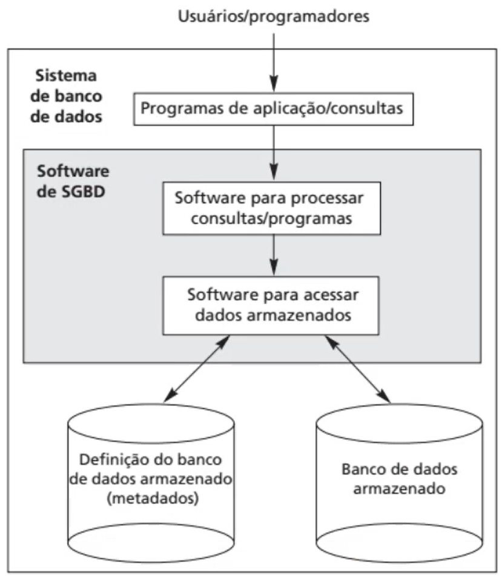
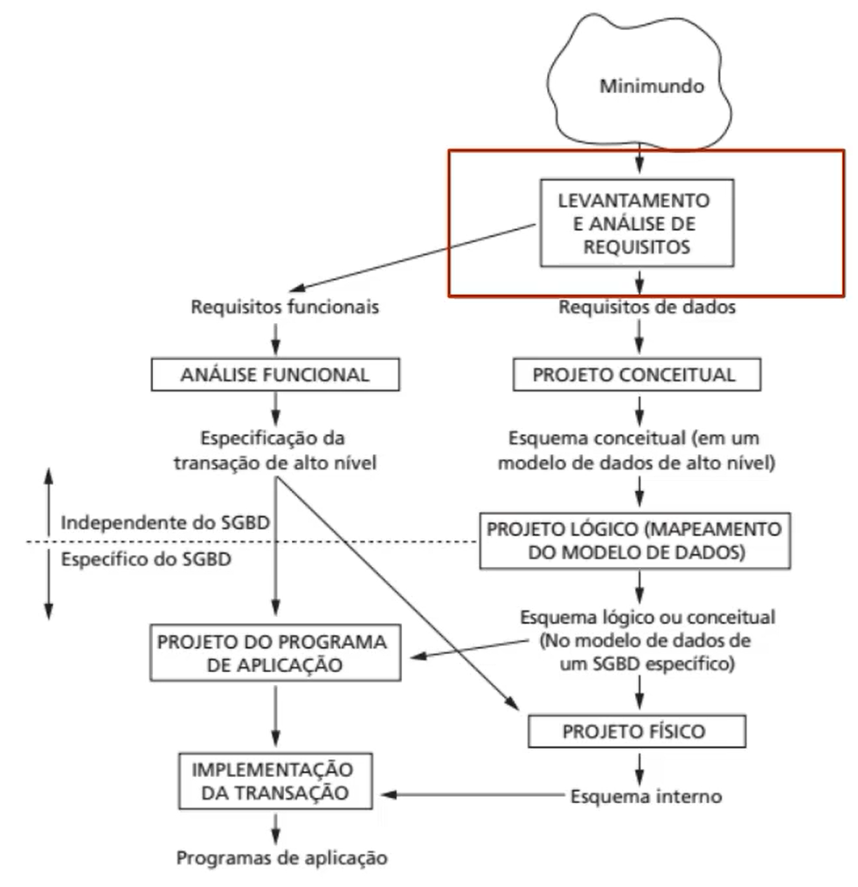
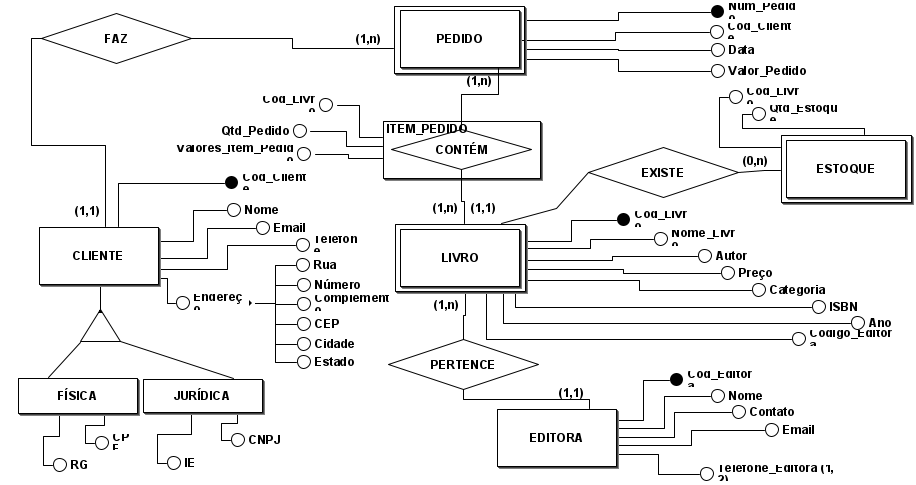
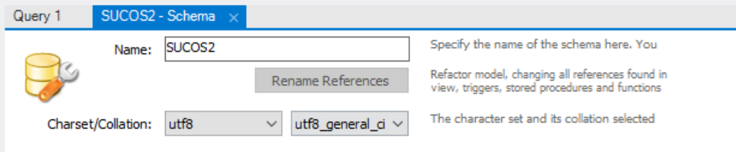

# Bancos de Dados

## modelagem-banco-relacional-entidade-relacionamento-atributo

- SGBD: sistema de gerenciamento de banco de dados:
    + Definição: Especifica tipos, estruturas e restrições dos dados armazenados (metadados)
    + Construção: processo de armazenar os dados em algum meio
    + Manipulção: (CRUD) funções de consulta, recuperar dados, atualizar dados, ou seja, refletir mudanças do mundo real
    + Compartilhamento: permite que usuários e programas o banco de dados simultaneamente

- Sistema de banco de dados: software SGBD + BD:
    
- MySQL, PostgreSQL, ORACLE, MariaDB, Microsoft SQL Server, SQLite, IBM DB2

- SGBD possui:
    - Modelos de alto nivel = modelos de entidade e relacionamento
    - Modelos representativos (relacionais) = SQL
    - Modelos de Baixo Nível = acesso a estrutura de armazenamento e indices
    - Esquema =/= Estado do banco de dados

- Etapas de modelagem de sistemas de bancos de dados:


- Modelo ER: modelo entidade-relacionamento
    - ENTIDADE: retângulo
        + coisa, pessoa ou objeto do mundo real com existência física ou conceitual 
        + Forte: com atributo forte 
        + Fraca: sem atributo chave (sempre associada a uma Entidade Proprietária, forte)
            > Relacionamento de identificação: relação entre Entidade fraca e proprietária, algumas vezes representado com retangulo duplo
    - ATRIBUTOS: elipse oval
        + descrevem a entidade
        + Chaves: sublinhados
            > atributos ÚNICOS, utilizados para identificar entidades de forma exclusiva
        + Chave complementar: sublinhados tracejados/pontilhados
            > atributo ÚNICO para relacionamento de identificação
        + Compostos: composto de partes menores, mais básicas
        + Simples: indivisíveis
        + Multivalorado: elipse oval dupla
            > formação acadêmica pode ser nenhuma, uma, duas, ...
        + Valor único: idade  
        + Derivados: idade pode ser DATA DE NASCIMENTO - DATA DE HOJE
        + Armazenados: DATA DE NASCIMENTO
        + NULL: desconhecidos ou não aplicáveis (casa não tem número de apartamento)
    - RELACIONAMENTO: losango
        + Relacionamento de identificação: losango duplo
        + Grau de relacionamento:
            > número de entidades envolvidas no relacionamento (binário, ternário)
        + Nome dos papéis: 
            > verbos que identificam o relacionamento
        + Recursivos: 
            > quando uma entidade se relaciona com ela mesma
        + Cardinalidade:
            > (1:1, 1:N, N:1, N:M), que aparecem na subida e descida do losango
        + Restrição de participação: determina cardinalidade mínima das relações entre entidades
            > Total: dependência de existência (sem funcionário não há departamento e vice-versa)
            >
            > linhas duplas ou (1,N) (min, MAX)
            >
            > Parcial: funcionario existe sem projeto, mas não o contrário.
            >
            > linha simples ou (0,X) (min, MAX)
        + Atributos de relacionamentos
        
    
- Entidade fraca é aquela que não identificamos nenhum atributo chave (depende de outra para existir)

- Migrando ATRIBUO para Entidade: 
    - Relacionamento 1:N
        + exige que seja migrado para o lado do 1 ou seja mantido como atributo do relacionamento
    - Relacionamento N:M
        + tem que ser mantido!

- Entidade especializada : triangulo em um atributo
    - cada ponto da base aponta para uma entidade (opções do valor do atributo)
    - entidade derivada recebe atributos da entidade original + especificos (herança)
    
- Entidade associativa:
    - Quando temos (1,N):(1,N) <=> N:N, cria-se uma entidade intermediária entre as anteriores

- Projeto ER_Livraria:


## modelagem-banco-relacional-entidade-relacionamento-modelo-relacional

- Relação: 
    - Conjunto de dados (atributos) organizados em colunas 
    - Possui um conjunto de tuplas (sequência de valores)
        + Tuplas majoritariamente têm uma identificação composta por um ou mais atributos (super chave) em que o mais importante atributo é a chave PRIMÁRIA
    - Podem ser ligadas por restrições de integridade referencial:
        + Sempre liga uma chave primária (de uma relação) à chave estrangeira (de outra relação)
        + Chaves primárias e estrangeiras devem pertencer ao mesmo domínio 
    - Seta sempre aponta para chave PRIMÁRIA


<details open>
<summary> Transformando um diagrama ER para modelo relacional</summary>
&nbsp;&nbsp;&nbsp;&nbsp;&nbsp;&nbsp;1. Para cada tipo de Entidade regular forte E, no diagrama de entidade-relacionamento, iremos criar uma relacao R que contenha todos os atributos da entidade. lremos incluir apenas os atributos de componentes simples de urn atributo que seja composto. Tambern iremos escolher o atributo chave da entidade como sendo a chave primaria da relacao. Se a chave escolhida da entidade for composta, o conjunto de atributos simples que a compoem formam juntos a chave primaria da relacao. 
<br><br>
&nbsp;&nbsp;&nbsp;&nbsp;&nbsp;&nbsp;2. Para cada tipo de entidade fraca F no esquema ER, que possui como entidade proprietária E, criaremos uma relação R com todos os atributos simples, ou componentes simples dos atributos compostos, de F como atributos R. Além disso vamos incluir como atributos de chave estrangeira de R os atributos de chave primária das relações que compõem os tipos de entidade proprietária. Isso vai fazer com que a chave primária final R será combinação das chaves primárias dos proprietários e da chave parcial do tipo de entidade fraca F, se houver. 
<br><br>
&nbsp;&nbsp;&nbsp;&nbsp;&nbsp;&nbsp;3. O próximo passo consiste em criar, no modelo relacional, para cada relacionamento R do tipo 1:1, Identifique as relações S e T que correspondem aos tipos de entidade participantes em R. Como se trata de relacionamento binário escolhemos urna das relações, digamos T, e inclua como chave estrangeira em T a chave primária de S. Vimos que uma relação pode ter atributos. Se isso acontecer inclua todos os atributos simples ou componente simples de atributos compostos do relacionamento binário como atributos de T. 
<br><br>
&nbsp;&nbsp;&nbsp;&nbsp;&nbsp;&nbsp;4. Para os relacionamentos R binários 1 para N, Identificamos a relação T representada pela entidade participante do lado N. logo inclua como chave estrangeira em T a Chave primária da relação S. Caso a relação tenha atributos inclua quaisquer atributos simples ou componente simples dos atributos compostos como atributos em T. 
<br><br>
&nbsp;&nbsp;&nbsp;&nbsp;&nbsp;&nbsp;5. Para cada relacionamentos R binários N:M, crie uma nova relação U para representar R. Inclua como atributo de chave estrangeira de U as chaves primárias das entidades participantes (S e T) . Sua combinação representará a chave primária em U. Inclua os atributos simples do relacionamento (Ou componentes simples dos atributos compostos) como atributos em U. Chamamos este tipo de representação como sendo uma Referência Cruzada. 
<br><br>
&nbsp;&nbsp;&nbsp;&nbsp;&nbsp;&nbsp;6. Para cada atributo multivalorado A, da entidade S, crie uma nova relação R. Esta relação R incluirá um atributo correspondente a A mais o atributo da chave primária de S como chave estrangeira. A chave primária de R será a combinação de A e da chave estrangeira vinda de S. 
<br><br>
&nbsp;&nbsp;&nbsp;&nbsp;&nbsp;&nbsp;7. Para cada Generalização G1 Gn de um atributos de Generalização criar uma relação correspondente. Esta relação terá a chave primária da relação que possui o atributo de Generalização como chave estrangeira mais os atributos especialistas de cada Generalização. A chave primária completa da Relação será composta da chave estrangeira da relação original. 
</details>

- Diretrizes:
    -DIRETRIZ 1: Projete urn esquema de Relagoes de modo que seja facil de explicar seu significado. 
    - DIRETRIZ 2 : Projete esquemas de Relagoes de modo que nenhuma anomalia de insergao, exclusao e modificagao esteja presente nas Relagoes. 
    - DIRETRIZ 3 : Evite, ao maxim° possivel, colocar Atributos em uma Relagao basica cujos valores podem ser Nulos corn frequencia. 
    - DIRETRIZ 4 : Projete esquemas de Relagoes de modo que possam ser unidos em condigoes de igualdade sobre Atributos pares relacionados corretamente de modo que nao seja gerada nenhuma Tupla falsa. 

## Formas normais

- 1FN:
    - Cada tupla contém exatamente um valor para cada atributo
    - Os atributos devem ser atômicos, indivisíveis
    - Atributos compostos e multivalorados devem ser representados por novas linhas ou novas tabelas
    - Decomposição da relação: 
        > idealmente, separar atributos multivalorados em múltiplas relações (tabelas)

- 2FN:
    - O esquema de relação R está na segunda forma normal se cada atributo não principal de A em R por total e funcionalmente dependente da chave primária de R.
    - Obedece 1FN.
    - Cada d.f. parcial tem atributos desnecessários removidos até que se torne total
    - Cada d.f. total se torna uma nova relação
    >
    > "Uma relação encontra-se na segunda forma normal se, e somente se, estiver na primeira forma normal e não contiver dependências parciais que envolvam a chave primária"
    > 
    - SE uma relação tem somente uma chave primária e está na1FN, ela obrigatoriamente está também na 2FN

- 3FN:
    - O esquema esta na 3FN se ele estiver na 2FN e nenhum atributo não principal de R (ou seja, não chave) for transitivamente dependente da chave primária
    - Quando temos X-> Z, Z-Y; X -> Y transitivamente. Então, Z se torna chave primária e decompomos a relação 
    >
    > "Decompor a relação original em outra que contenha as colunas que dependem transitivamente da outra coluna, que não faz parte da chave primária"
    >

- FNBC:
    - FNBC existe quando toda d.f. da relação tem como determinante uma chave candidata
    - Solução: decompor para outra relação que tem como chave primaria a determinante da relação anteriormente problemática.
    >
    > "Todas as setas no diagrama dependência funcional, são setas originárias de chaves candidatas"
    >
    > "Se toda a dependência funcional não trivial se mantiver em R, então o determinante deve ser uma chave candidata"
    >

- 4FN:
    - 3FN e não possui dependência multivalorada


- 5FN ou FNPJ (forma normal projeção-junção):
    - Evita dependencia de junção:
        > Se uma Relação R possui 3 atributos A1, A2 e A3 teremos 3 projeções para ela: R1={A1.A2}. R2={A2.A3}. R3={A3,A1}. Charnamos uma Dependencia de Junção quando todas as tuplas da relação R puderem ser formadas destas 3 projecoes simultaneamente, R1, R2 e R3. R*(R1, R2, R3)
    - Uma tabela estará em 5FN se estiver em 4FN e não contiver DJs que não sejam determinadas por chaves candidatas. Em outras palavras, se for possível n-decompor a tabela, então ela deverá ser substituída por suas n projeções para estar na 5FN. 


## MySQL CRUD

- Banco de dados
    - Tabelas
        - Colunas (PK/FK)

- [Docs](https://dev.mysql.com/doc/refman/8.0/en/create-database.html)

```SQL
CREATE DATABASE SUCOS;
```

- Podemos criar usando wizard:


- Mas ele também gera código:
```SQL
CREATE SCHEMA `sucos2` DEFAULT CHARACTER SET utf8 ;
```

- Deletando um db ou schema:
```SQL
DROP DATABASE SUCOS;
```

- Também funciona via CLI:

(add imgs)

- Criando TABELAS:
```SQL
CREATE TABLE TABELA_DE_VENDEDORES (
    MATRICULA varchar(5), 
    NOME varchar(100), 
    PERCENTUAL_COMISSAO float
);
```

- Principais Tipos:
    - TINYINT, SMALLINT, MEDIUMINT, INT, BIGINT
    - FLOAT, DOUBLE(DÍGITOS, CASAS DECIMAIS)
    - DECIMAL, NUMERIC
    - BIT
    + Atributos:
        - SIGNED, UNSIGNED 
        - ZEROFILL
        - AUTO_INCREMENT
    + Data e hora:
        - DATE, DATETIME, TIMESTAMP, TIME, YEAR
    + STRING:
        - CHAR, VARCHAR
        - BINARY, VARBINARY
        - BLOB (TINYBLOB, BLOB, MEDIUMBLOB, LONGBLOB)
        - TEXT (TINYTEXT, TEXT, MEDIUMTEXT, LONGTEXT)
        - ENUM
        - SET, COLLATE
    + SPACIAL:
        - GEOMETRY, POINT, LINESTRING, POLYGON

- Exemplo:
```SQL
CREATE TABLE tbCliente
(CPF VARCHAR(11),
NOME VARCHAR(100),
ENDERECO1 VARCHAR(150),
ENDERECO2 VARCHAR(150),
BAIRRO VARCHAR(50),
CIDADE VARCHAR(50),
ESTADO VARCHAR(50),
CEP VARCHAR(8),
IDADE SMALLINT,
SEXO VARCHAR(1),
LIMITE_CREDITO FLOAT,
VOLUME_COMPRA FLOAT,
PRIMEIRA_COMPRA BIT(1)
);
```

- Apagando:
```SQL
DROP TABLE `sucos`.`tbcliente3`;
```

- Ou também:
```SQL
USE SUCOS;
DROP TABLE tbcliente3;
```

- Inserindo dados:
```SQL
USE SUCOS;
INSERT INTO tbProduto (
	PRODUTO, NOME, EMBALAGEM, TAMANHO, SABOR, PRECO_LISTA) 
    VALUES (
    '1040107', 'Light - 350 ml - Melancia',
    'Lata', '350 ml', 'Melancia', 4.56);

SELECT * FROM tbproduto;
```

- Alterando:
```SQL
UPDATE TABELA_DE_VENDEDORES SET PERCENTUAL_COMISSAO = 0.11
WHERE MATRICULA = '00236';

UPDATE TABELA_DE_VENDEDORES SET NOME = 'José Geraldo da Fonseca Junior'
WHERE MATRICULA = '00233';
```

- Apagando um registro:
```SQL
DELETE FROM TABELA_DE_VENDEDORES WHERE MATRICULA = '00233'; 
```

- Adicionando PK em uma tabela já existente:
```SQL
USE sucos;
ALTER TABLE tbproduto ADD PRIMARY KEY (PRODUTO);
ALTER TABLE tbcliente ADD PRIMARY KEY (CPF);
ALTER TABLE tbcliente ADD COLUMN (DATA_NASCIMENTO DATE);
```

- Requerindo dados, com alias, com filtro:
```SQL
SELECT * FROM tbproduto;
SELECT CPF AS CPF_CLIENTE, NOME FROM tbcliente;
SELECT * FROM tbcliente WHERE CIDADE = 'Rio de Janeiro';
```

- WHERE também pode ser usado em outros comandos:
```SQL
UPDATE tbproduto SET SABOR = 'Cítricos' WHERE SABOR = 'Limão';
```

- SQL usa ordem alfabética comum para filtrar nomes:
```SQL
SELECT * FROM tbcliente WHERE NOME >= 'Fernando Cavalcante';
```

- Filtros de datas funcionam igualmente, mas existem funções específicas auxiliadoras: MONTH(DATA_NASCIMENTO), por exemplo.

- Não é boa prática fazer comparações =, <= e >= com ponto flutuante! Pode-se usar between.

- Funções de agregação, ordenação:
```SQL
USE adventureworks;
SELECT SalesOrderID, MONTH(OrderDate) as Mes
FROM SalesOrderHeader;

SELECT AVG(TotalDue) Média, DAYOFYEAR(OrderDate) as Dia
FROM SalesOrderHeader
GROUP BY DAYOFYEAR(OrderDate)
ORDER BY Dia;
```

```SQL
SELECT AVG(TotalDue) Média, DAYOFYEAR(OrderDate) as Dia
FROM SalesOrderHeader
GROUP BY DAYOFYEAR(OrderDate) HAVING Média >1000
ORDER BY Dia LIMIT 10;
```

- Outer é default:
```SQL
SELECT COUNT(productid) FROM SalesOrderDetail TabA
RIGHT OUTER JOIN SalesOrderHeader TabB
ON TabA.SalesOrderId = TabB.SalesOrderId;
```

```SQL
SELECT COUNT(productid) FROM SalesOrderDetail TabA
RIGHT JOIN SalesOrderHeader TabB
ON TabA.SalesOrderId = TabB.SalesOrderId;
```
> Ambos COUNT(productid) retornam: 121317

- Right vs Left:
```SQL
SELECT TabA.ProductID ,TabB.Name, TabA.StandardPrice FROM ProductVendor TabA
RIGHT JOIN Product TabB
ON TabA.ProductID = TabB.ProductID;
```
> contem preços nulos

```SQL
SELECT TabA.ProductID ,TabB.Name, TabA.StandardPrice FROM ProductVendor TabA
LEFT JOIN Product TabB
ON TabA.ProductID = TabB.ProductID;
```

- Analisando:
```SQL
SELECT * FROM ProductVendor TabA
INNER JOIN Product TabB
ON TabA.ProductID = TabB.ProductID;
```

- Full outer:
```SQL
SELECT * FROM ProductVendor TabA RIGHT JOIN Product TabB ON TabA.ProductID = TabB.ProductID
UNION
SELECT * FROM ProductVendor TabA LEFT JOIN Product TabB ON TabA.ProductID = TabB.ProductID;
```
