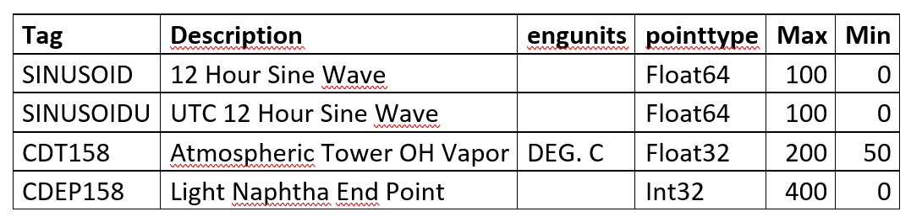
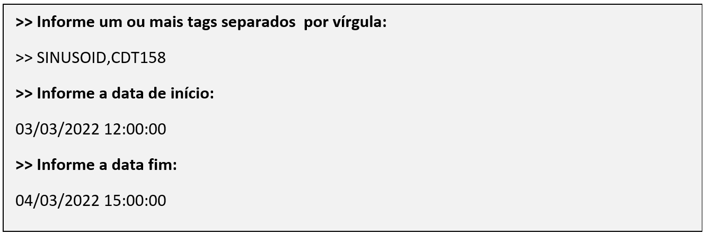
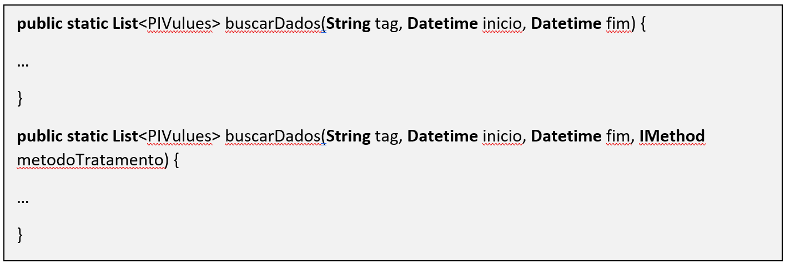
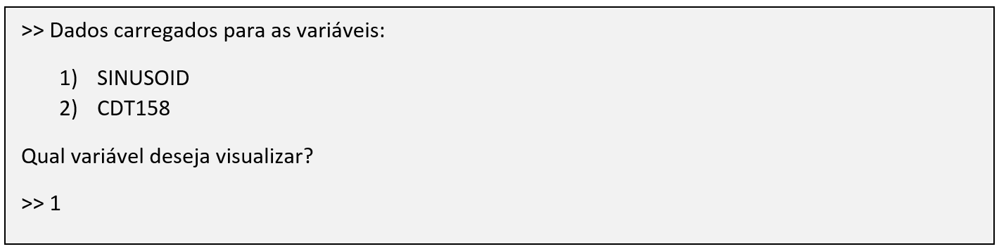

# Descrição

Os sistemas PIMS (plant information management system - [https://en.wikipedia.org/wiki/Plant_Information_Management_System](https://en.wikipedia.org/wiki/Plant_Information_Management_System)) são sistemas amplamente utilizados na indústria, e consequentemente em projetos da RADIX.

Os dois principais fornecedores de sistema PIMS são a OsiSoft e a Aspentech. Esses sistemas são tão utilizados na RADIX que somos um dos principais parceiros da Osisoft no mundo, figurando sempre entre os primeiros lugares em termos de profissionais certificados.

Na prática, os sistemas PIMS são banco de dados otimizado para processar, armazenar, estruturar e disponibilizar dados de séries temporais. Em grande maioria seus dados são de variáveis de processo como temperatura, corrente, vazão, pressão etc., provenientes de sensores da planta.

Nesse desafio, será feita uma integração com um ambiente PIMS de testes da RADIX através de um Web service RESTful ([https://pt.wikipedia.org/wiki/REST](https://pt.wikipedia.org/wiki/REST)).

O nome de uma variável no PIMS é chamado de “tag”.

Nessa solução, trabalharemos com os seguintes tags:

A aplicação deverá receber de input do usuário um ou mais tags, uma data de início e uma data fim:

Após informados os tags, a aplicação deverá armazenar os dados em um Singleton, que funcionará como um cache ([https://pt.wikipedia.org/wiki/Cache](https://pt.wikipedia.org/wiki/Cache)) da aplicação. Esse cache deverá fazer uso de uma chave que deve ser igual ao nome do tag, e armazenar uma lista de um objeto com timestamp e valor.

O método que busca os dados da API REST deverá possuir duas sobrecargas, conforme o pseudocódigo a seguir:

Onde IMethod é uma interface funcional que permite passar uma função lambda para fazer um pós-processamento dos dados antes de retornar os valores (por exemplo, remover todos os números negativos).

Após buscados e armazenados os dados, a aplicação deverá perguntar ao usuário qual variável deseja apresentar o gráfico. Ex:

A aplicação deverá então apresentar um gráfico com os valores obtidos do PIMS.
