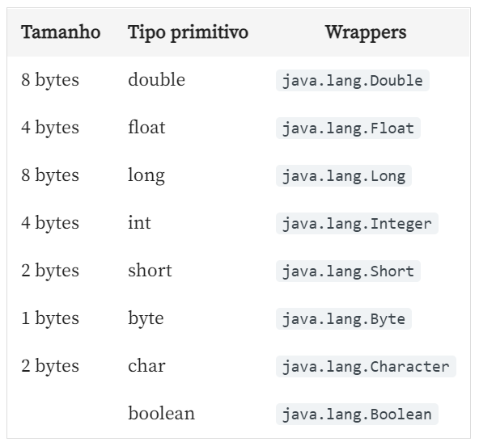

# Java e java.util: Coleções, Wrappers e Lambda expressions

- Forma literal de declarar arrays: 
``` java
int[] refs = {1,2,3,4,5};
```
- Exemplo: java.lang.ClassCastException: 
``` java
Conta[] contas = new Conta[5];
ContaPoupanca cc2 = new ContaPoupanca(42, 2);
contas[1]= cc2;
// cast de referencia
ContaCorrente ref = (ContaCorrente) contas[1]; 
// => Exception in thread "main" java.lang.ClassCastException
```

### Cast implícito e explícito de primitivos
```java
int numero = 3;
double valor = numero; //cast implícito
```

```java
int numero = 3;
double valor = (double) numero; //cast explícito
```

```java
double valor = 3.56;
int numero = (int) valor; //cast explicito é exigido pelo compilador
```

### Cast implícito e explícito de referencias
```java
ContaCorrente cc1 = new ContaCorrente(22, 33);
Conta conta = cc1; //cast implicito
```

```java
ContaCorrente cc1 = new ContaCorrente(22, 33);
Conta conta = (Conta) cc1; //cast explícito mas desnecessário
```
- Enhanced for (similar a foreach) itera atraves de um ArrayList:
```java
	public static void main(String[] args) {
	
		ArrayList lista = new ArrayList();
		
		System.out.println(lista.size());
		
		Conta cc = new ContaCorrente(42, 1);
		lista.add(cc);
		
		Conta cc2 = new ContaCorrente(42, 2);
		lista.add(cc2);
		
		int tamanho = lista.size();
		System.out.println("Tamanho antes de remover: "+tamanho);
		
		Conta ref = (Conta) lista.get(0);
		System.out.println(ref.getNumero());

		lista.remove(0);
		System.out.println("Tamanho apos remover: "+lista.size());
		
		Conta cc3 = new ContaPoupanca(42, 3);
		lista.add(cc3);
		Conta cc4 = new ContaCorrente(42, 4);
		lista.add(cc4);
		
		for(int i = 0; i < lista.size(); i++) {
//			System.out.println(lista.get(i));
			Object oRef = lista.get(i);
			System.out.println(oRef);
		}
		
		System.out.println("\n ------------- \n");
		
		for(Object oRef: lista) {	// enhanced for itera para cada elemento
			System.out.println(oRef);
		}
	}
```

- Listas tipadas:
```java
ArrayList<Conta> lista = new ArrayList();

// Com lista tipada fica mais claro/expressivo:
for(Conta conta: lista) {
    System.out.println(conta);
}
```

- Pode-se sobrecarregar o construtor da lista tipada para inicializar com tamanho fixo, ou tambem inicializar com tamanho de outra lista (passando a outra lista como parametro):
```java
ArrayList lista = new ArrayList(26); //capacidade inicial
lista.add("RJ");
lista.add("SP");
//outros estados
ArrayList nova = new ArrayList(lista); //criando baseado na primeira lista
```

- a interface java.util.List que define os métodos da lista
- Java possui LinkedList (lista duplamente ligada)
- Existe também Vector (threadsafe, menos eficiente)

# 

- Tipos primitivos possuem classes, então eles também tem referencias (debaixo dos panos, ex: "classe" Integer => autoboxing)

- definição:

```
Primitivo >- autoboxing -> Wrapper
boolean   ================ java.lang.Boolean
Primitivo <-   unboxing -< Wrapper
```

- Para pegar e usar a referencia de um inteiro, por exemplo:
```java
Integer idadeRef = Integer.valueOf(29);  // autoboxing
int valor = idadeRef.intValue(); // unboxing
// autoboxing e unboxing "na unha"
```

- Devido aos wrappers, podemos executar:
```java
public class TesteWrapper {

    public static void main(String[] args){
        Integer ref = Integer.valueOf("3");
        ref++;
        System.out.println(ref);
    }
}
```

- Polimorfismo de Wrappers:
```java
List<Object> referencias = new ArrayList<>();
List<Number> referencias = new ArrayList<>();
List referencias = new ArrayList();
// todos sao identicos
```

- "Todas as classes wrappers que representam um valor numérico possuem a classe java.lang.Number como mãe"


#
- É possivel comparar e ordenar usando minhaLista.sort(new MeuComparator()) assim como usando Collections.sort(minhaLista, new MeuComparator()) 
- Ou também, pode-se utilizar Collections.sort(minhaListaComOrdemNatural), em que a ordem natural é dada pela implementação do metodo compareTo() ao implementar a interface Comparable (na classe contida na lista).
- Q: No contexto da aula, o que significa ordem natural?
- A: É a ordem definida pelo próprio elemento da lista.
- Collections também apresenta outros métodos uteis como:
	- Collections.reverse(lista);
	- Collections.shuffle(lista);
	- Collections.rotate(lista, 5); //rotacionar 5 posicoes

#
- Function objects: objeto que encapsula uma função (ex: new ComparaAlgo(), precisa ser instanciada apenas para implementar o metodo compare() por implementar a interface comparator)
- Q: Como chamamos esse objeto que só encapsula uma função/método/procedimento?
- A: Function Object -> um objeto que criamos para encapsular uma função ou método. As classes anônimas facilitam um pouco a criação desses objetos.

- É possivel criar classes anonimas direto no momento de instacia-las:
```java
lista.sort(new Comparator<Conta>() {

        @Override
        public int compare(Conta c1, Conta c2) {

            return Integer.compare(c1.getNumero(), c2.getNumero());
                    }
        }

    );
```

- Transformando a classe anterior em lambda (enxugando):
```java
lista.sort( (Conta c1, Conta c2) -> {
                        return Integer.compare(c1.getNumero(), c2.getNumero());
                }
        	);
```
- Por baixo dos panos, o java gera uma classe, que implementa a interface, que sobrescreve compare(), que recebe os parametros Conta c1, Conta c2 e retorna um inteiro. 

- Limpando ainda mais: 
```java
lista.sort( (c1, c2) -> Integer.compare(c1.getNumero(), c2.getNumero()) );
```

- Podemos ainda guardar lambdas em objetos do tipo correto:
```java
Comparator<Conta> comp = new Comparator<Conta>() {

                        @Override
                        public int compare(Conta c1, Conta c2) {
                            String nomeC1 = c1.getTitular().getNome();
                            String nomeC2 = c2.getTitular().getNome();
                            return nomeC1.compareTo(nomeC2);
                        }
                };
```

- Temos ainda a interface Consumer exigida pelo método .forEach() das listas, por exemplo
```java
nomes.forEach((nome) -> System.out.println(nome));
```
- [Bom guia para a apresentacao](https://cursos.alura.com.br/course/java-util-lambdas/task/37835)